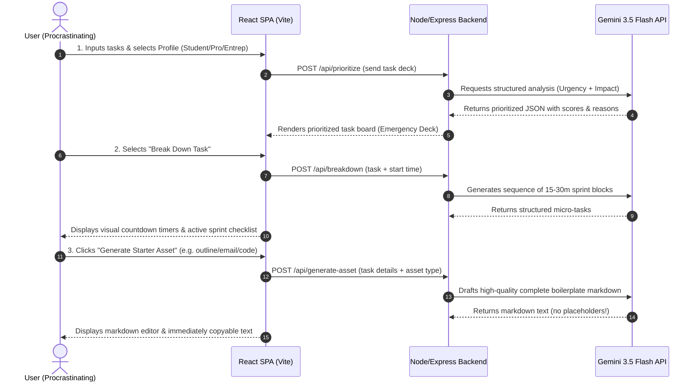

# Project Description: Clutch AI 🚀

Welcome to **Clutch AI**, an ultra-proactive, AI-powered productivity companion specifically engineered for students, professionals, and entrepreneurs battling procrastination, looming deadlines, and high-stakes crunch times.

---

## 1. Problem Statement Selected

### The Crisis of Last-Minute Panic
Traditional productivity apps and todo lists are **fundamentally passive**. They act as simple digital filing cabinets: they store lists, trigger dry notifications, and wait for the user to somehow find the "activation energy" to begin. 

For users facing overwhelming deadlines, this passive approach fails because:
1. **Decision Paralysis (The Activation Barrier):** When faced with a massive, high-stakes task (e.g., writing a 10-page report, drafting a critical client email, or setting up a database), the sheer size of the task paralyzes the user. They don't know where to start, leading to further procrastination.
2. **Prioritization Blindness:** Users in crisis often fail to estimate realistic efforts, focusing on minor details instead of the highest-impact bottlenecks.
3. **Cognitive Load & Stress:** The pressure of a countdown timer causes panic, reducing focus and making standard planning systems feel like an extra chore rather than a solution.

### Our Mission
**Clutch AI** transforms the relationship between the procrastinator and their workload. Instead of asking the user to plan, **the AI takes the first step**. It ranks tasks by dynamic urgency, splits big projects into 15-to-30-minute high-focus sprints, drafts the actual content (email drafts, outlines, code boilerplates) to destroy writer's block, and acts as a firm, empathetic deadline coach.

---

## 2. Solution Overview

**Clutch AI** is a full-stack, AI-first application that functions as an active productivity co-pilot:

```
+------------------------------------------------------------+
|                          CLUTCH AI                         |
|                                                            |
|   +-------------------+    +---------------------------+   |
|   | 1. Dynamic Task   |    | 2. Sprint Breakdown       |   |
|   |    Prioritizer    |    |    (15-30m micro-tasks)   |   |
|   +---------+---------+    +-------------+-------------+   |
|             |                            |                 |
|             v                            v                 |
|   +-------------------+    +---------------------------+   |
|   | 3. Proactive Asset|    | 4. AI Deadline Coach      |   |
|   |    Generator      |    |    (Empathetic & Firm)    |   |
|   +-------------------+    +---------------------------+   |
|                                                            |
+------------------------------------------------------------+
```

By connecting the client dashboard directly to a customized Express server powered by **Gemini 3.5 Flash**, we offer a seamless, high-velocity loop of **Prioritize ➔ Break Down ➔ Draft Asset ➔ Execute**.

---

## 3. Workflows & System Architecture

### A. Core Task Resolution Workflow (End-to-End)

The diagram below details how a user interacts with the system, from experiencing deadline anxiety to generating sprint plans.



### B. User State & Active Profiles
The companion adapts to the selected user persona, customizing the AI voice and the pre-seeded tasks:
- **Academic (Students):** Sprints focus on reading comprehension, outlines, and paper structures.
- **Professional (Employees):** Sprints prioritize client emails, slide decks, status updates, and code.
- **Entrepreneur (Founders):** Sprints focus on investor updates, product mockups, and pitch scripts.

---

## 4. Key Features

1. **Intelligent Dynamic Prioritization:** Uses a server-side Gemini 3.5 model to assess a batch of tasks, evaluate due times, and rank them. Gives each task a score (0–100) and an honest, highly motivating explanation (e.g., *"If you don't draft this proposal by 5 PM, your weekly team sprint will stall. Stop editing the fonts, start drafting now."*).
2. **Micro-Scheduling & High-Focus Sprint Sprints:** Converts overwhelming tasks into bite-sized sequential sprints of 15, 20, or 30 minutes, complete with active visual countdown trackers to lock the user into deep work.
3. **Activation Energy Reducer (Starter Assets):** Instantly drafts real-world materials including:
   - **Email Drafts:** Fully composed, professional messages ready to send.
   - **Project Outlines:** Deeply structured sections to kickstart essays/reports.
   - **Code Boilerplates:** Working TypeScript/JavaScript or scripts to bypass setup friction.
   - **Talking Points:** Meeting speaking notes and pitch bullets.
4. **Firm, Conversational Deadline Coach:** An AI companion panel that refuses to let you slide. It supports chat-based interactions that are always direct, empathetic to stress, but strictly biased towards the *Next Best Action*.
5. **Robust Local Session Persistence:** Safely saves task boards, active sprints, and chats to standard browser local storage, ensuring continuous local state recovery without complex account requirements.

---

## 5. Technologies Used

- **Frontend (Client-side):**
  - **React 19 & TypeScript:** Building the component layout, reactive state, and robust client logic.
  - **Vite:** High-performance local development build tool.
  - **Tailwind CSS:** Dynamic and modern styling framework.
  - **Lucide React:** Clean, uniform vector icons for actions and status markers.
  - **Motion (Framer Motion):** Smooth layout animations, alert indicators, and sprint countdown pulses.
- **Backend (Server-side):**
  - **Express (Node.js):** Custom full-stack API server hosting core business logic.
  - **Esbuild:** High-velocity bundler creating a single self-contained production bundle.
  - **Tsx:** TypeScript execution engine for developmental server runs.

---

## 6. Google Technologies Utilized

- **Gemini 3.5 Flash (via `@google/genai`):**
  - Powers **动态优先级引擎 (Dynamic Prioritizer)** with strict JSON schema outputs.
  - Powers **微型任务拆解 (Micro-scheduler)** to turn complex multi-day projects into structured sprint cards.
  - Powers **极速首期资源编写 (Proactive Asset Writer)** to bypass writer's block by drafting complete paragraphs.
  - Powers **监督式伴侣聊天 (Empathetic Deadline Coach)**.
